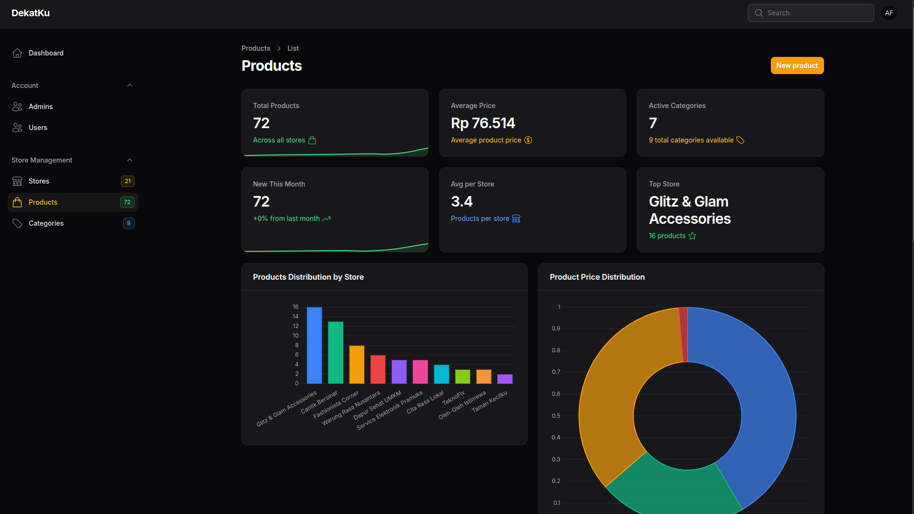
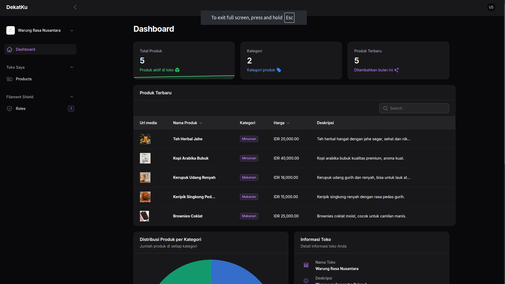

# Dekatku

Dekatku adalah platform direktori berbasis lokasi yang menghubungkan masyarakat (wisatawan/pengunjung) dengan UMKM dan Penyedia Jasa Lokal. Aplikasi ini membantu menemukan usaha rumahan yang biasanya sulit ditemukan di mesin pencari umum. Dengan integrasi Geolocation dan AI, Dekatku memberikan rekomendasi usaha terdekat secara cerdas dan akurat.

---

## 📸 Tampilan Aplikasi
Dashboard Admin & Panel Console (Filament)




Dekatku menggunakan **FilamentPHP multi-panel** untuk memisahkan hak akses antara Admin dan Panel Console (pelaku usaha).

---

## ✨ Fitur Utama

### 1. 🌍 Geolocation & Peta Interaktif
- Deteksi lokasi real-time untuk akurasi tinggi.
- Integrasi **Leaflet.js** (gratis, open-source, ringan).
- Menampilkan rute dari pengguna ke lokasi usaha.

### 2. 🤖 Integrasi AI (Smart Recommendation)
- Menggunakan **Groq AI** sebagai mesin LLM super cepat.
- Chatbot konsultasi pencarian dengan bahasa natural.
- Rekomendasi berdasarkan jarak dan relevansi usaha.

### 3. 🏪 Direktori Komprehensif
- UMKM produk: makanan, kerajinan, suvenir.
- Penyedia jasa lokal: reparasi, kebersihan, makeup, dll.
- Mendukung usaha rumahan tanpa toko fisik.

### 4. 🔐 Manajemen Data & Console (Filament Panel)

#### Admin Console
- Dashboard analitik.
- Moderasi data usaha (approve/reject listing).
- Manajemen user & konfigurasi.

#### Panel Console (Mitra)
- Manajemen profil usaha.
- Upload foto.
- **Pinpoint lokasi** menggunakan peta Leaflet (klik/geser marker).

---

## 🔄 Alur Kerja Sistem

### A. Alur Pengguna
1. Pengguna membuka web → mengizinkan akses lokasi.
2. Sistem menghitung jarak terdekat (Laravel backend).
3. Pencarian:
   - Filter manual kategori / produk / jasa.
   - AI (chatbot) untuk query natural.
4. Pengguna memilih usaha → ditampilkan rute di peta.

### B. Alur Panel Console (Mitra)
1. Registrasi & verifikasi akun.
2. Login ke Panel Console.
3. Input data usaha dan upload foto.
4. Menentukan lokasi usaha via Leaflet Map.
5. Data dikirim untuk approval Admin Console.

---

## 🛠 Stack Teknologi

| Komponen | Teknologi | Alasan |
|---------|-----------|--------|
| Backend | Laravel | Aman, stabil, ekosistem kuat |
| Frontend | React | Modern, interaktif, UX responsif |
| Admin Panel | FilamentPHP | Multi-panel, cepat dibangun |
| Maps | Leaflet.js | Gratis & ringan |
| AI Engine | Groq API | LLM tercepat untuk real-time |
| Database | MySQL | Andal untuk data relasional |

---

## 🚀 Panduan Instalasi (Development)

### **Prasyarat**
- PHP >= 8.1
- Composer
- Node.js & NPM
- MySQL
- Akun Groq Cloud (API Key AI)

### **1. Clone Repository**
```bash
git clone https://github.com/username-anda/dekatku.git
cd dekatku
```

### **2. Install Backend (Composer)**
```bash
composer install
```

### **3. Setup Environment & API Key**
```bash
cp .env.example .env
```
Edit file **.env**:
```
DB_DATABASE=dekatku_db
DB_USERNAME=root
DB_PASSWORD=

GROQ_API_KEY=gsk_xxxxxxxxxxxxxxxxxxxxxxxxxxxx
```

### **4. Generate App Key & Migrasi Database**
```bash
php artisan key:generate
php artisan migrate --seed
```

### **5. Install Frontend (React)**
```bash
npm install
npm run dev
```

### **6. Jalankan Server**
```bash
php artisan serve
```

Akses:
- Web App: http://localhost:8000
- Admin Console: http://localhost:8000/admin
- Panel Console: http://localhost:8000/console

---

## 🤝 Kontribusi
Silakan buat Pull Request untuk pengembangan fitur atau perbaikan bug.

---

## 📄 Lisensi
Proyek ini menggunakan **MIT License**.
